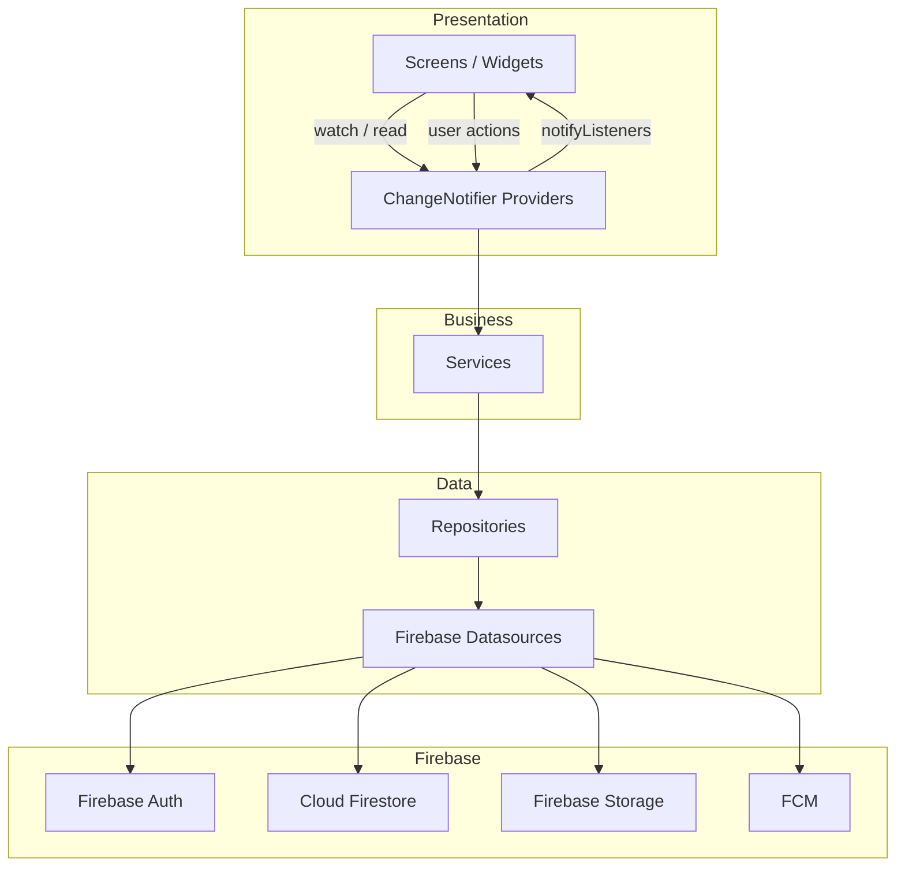
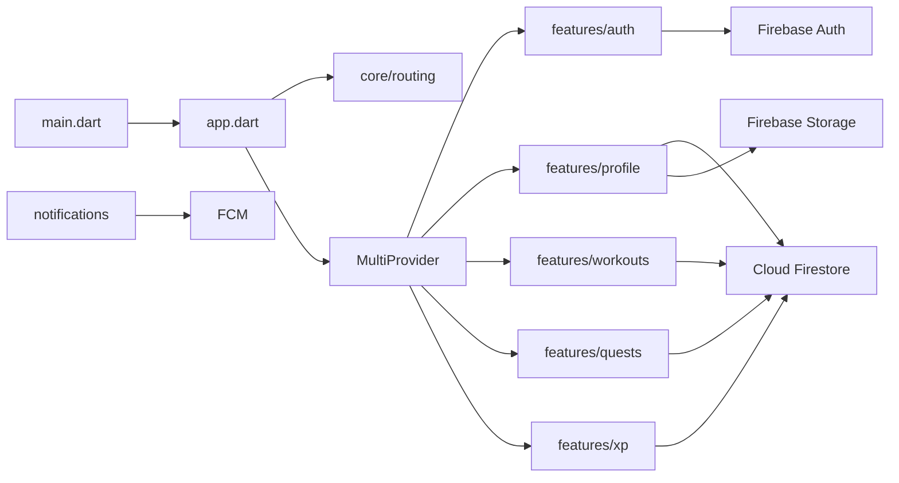
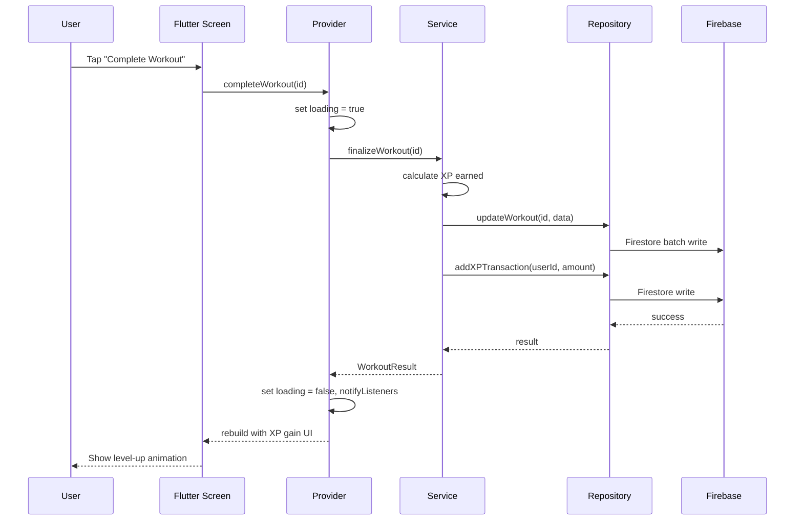
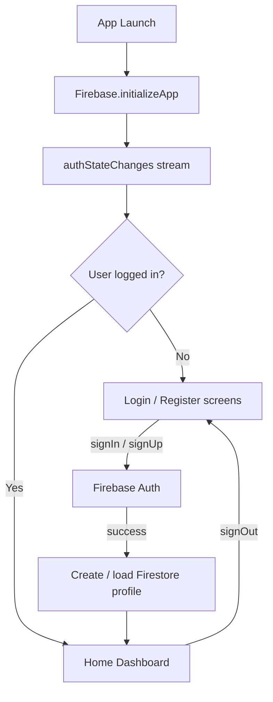

# Architecture

> **Last verified against source code:** 2026-06-23  
> **Stack:** Flutter + Firebase + Provider + Feature-first modular  
> **Current state:** Architecture defined; application code not yet scaffolded.

---

## Folder Structure Tree

### Current (Implemented)

```
AscendFit/
└── docs/
    ├── AI_CONTEXT.md
    ├── PROJECT_OVERVIEW.md
    ├── ARCHITECTURE.md
    ├── DATABASE_SCHEMA.md
    ├── API_DOCUMENTATION.md
    ├── UI_SCREENS.md
    ├── FEATURES.md
    ├── CURRENT_PROGRESS.md
    ├── NEXT_TASKS.md
    ├── CHANGELOG.md
    └── DECISIONS.md
```

### Target Application Structure (Planned — Not Yet Created)

```
AscendFit/
├── android/                        # Android platform (primary target)
├── ios/                            # iOS platform (future)
├── docs/
├── lib/
│   ├── main.dart                   # Entry point, Firebase init, runApp
│   ├── app.dart                    # MaterialApp, providers, router
│   │
│   ├── core/                       # App-wide infrastructure
│   │   ├── constants/              # App constants, Firestore paths
│   │   ├── theme/                  # Colors, typography, ThemeData
│   │   ├── routing/                # go_router configuration
│   │   ├── firebase/               # Firebase bootstrap, options
│   │   └── utils/                  # Helpers, extensions, validators
│   │
│   ├── shared/                     # Cross-feature shared code
│   │   ├── widgets/                # Reusable UI components
│   │   ├── models/                 # Shared data models
│   │   └── providers/              # App-level providers (auth state)
│   │
│   └── features/                   # Feature-first modules
│       ├── auth/
│       │   ├── data/
│       │   │   ├── datasources/    # Firebase Auth calls
│       │   │   └── repositories/   # AuthRepository
│       │   ├── domain/
│       │   │   └── models/         # User, AuthState models
│       │   ├── presentation/
│       │   │   ├── screens/        # Login, Register, ForgotPassword
│       │   │   ├── widgets/
│       │   │   └── providers/      # AuthProvider
│       │   └── services/           # AuthService (business logic)
│       │
│       ├── profile/
│       │   ├── data/
│       │   ├── domain/
│       │   ├── presentation/
│       │   └── services/
│       │
│       ├── workouts/
│       │   ├── data/
│       │   ├── domain/
│       │   ├── presentation/
│       │   └── services/
│       │
│       ├── exercises/
│       │   ├── data/
│       │   ├── domain/
│       │   ├── presentation/
│       │   └── services/
│       │
│       ├── xp/
│       │   ├── data/
│       │   ├── domain/
│       │   ├── presentation/
│       │   └── services/
│       │
│       ├── quests/
│       │   ├── data/
│       │   ├── domain/
│       │   ├── presentation/
│       │   └── services/
│       │
│       └── notifications/
│           ├── data/
│           ├── domain/
│           ├── presentation/
│           └── services/
│
├── test/                           # Unit and widget tests
├── integration_test/               # Integration tests
├── pubspec.yaml
├── analysis_options.yaml
├── firebase.json                   # Firebase CLI config
├── firestore.rules                 # Security rules
├── firestore.indexes.json
├── storage.rules
├── .gitignore
└── README.md
```

---

## Module Explanations

| Module | Purpose |
|--------|---------|
| `lib/core/` | App-wide constants, theme, routing, Firebase bootstrap — no feature logic |
| `lib/shared/` | Reusable widgets, shared models, app-level providers used across features |
| `lib/features/*/` | Self-contained feature modules (auth, workouts, xp, quests, etc.) |
| `features/*/presentation/` | Screens, widgets, Providers — UI layer only |
| `features/*/services/` | Business logic orchestration — no direct Firebase calls |
| `features/*/data/repositories/` | Data access abstraction — Firestore/Auth/Storage calls |
| `features/*/data/datasources/` | Raw Firebase SDK interactions |
| `features/*/domain/models/` | Immutable data models / entities |

---

## State Management Architecture (Provider)



### Provider Boundaries

| Scope | Provider | Responsibility |
|-------|----------|----------------|
| App-wide | `AuthProvider` | Current user session, auth state stream |
| App-wide | `ThemeProvider` (optional) | Theme mode |
| Feature | `WorkoutProvider` | Workout list, active session state |
| Feature | `ProfileProvider` | User profile, level, XP display |
| Feature | `QuestProvider` | Daily quests, completion state |
| Feature | `XPProvider` | XP transactions, level calculations |

### Rules

- **Screens** consume providers via `context.watch` / `context.read` — no direct Firebase calls.
- **Providers** delegate to services; handle loading/error state and call `notifyListeners()`.
- **Services** contain business rules (XP calculation, quest validation) — no UI state.
- **Repositories** abstract Firestore/Auth paths — swappable for testing.

---

## Dependency Graph



---

## Data Flow



---

## Backend Architecture (Firebase)

AscendFit uses **Firebase as a Backend-as-a-Service**. There is no custom REST API server for MVP.

| Firebase Product | Role |
|------------------|------|
| **Firebase Authentication** | User identity, session tokens |
| **Cloud Firestore** | Primary data store (profiles, workouts, quests, XP) |
| **Firebase Storage** | User avatars, workout media |
| **Firebase Cloud Messaging** | Push notifications |
| **Cloud Functions** (optional, post-MVP) | Server-side XP validation, AI proxy, scheduled quests |
| **Firebase Security Rules** | Server-side data access enforcement |

### When to Add Cloud Functions

- AI workout generation (hide API keys)
- Scheduled daily quest generation
- Complex XP validation that must not be client-trusted
- FCM topic management

---

## Frontend Architecture (Flutter)

| Concern | Approach |
|---------|----------|
| **Routing** | `go_router` with auth redirect guards |
| **Theming** | Material 3 theme in `core/theme/` |
| **Forms** | Validators in `core/utils/` |
| **Error handling** | Provider error state + SnackBar / error widgets |
| **Offline** | Firestore offline persistence (enabled by default on mobile) |
| **Platform priority** | Android first; iOS folder maintained for future scaling |

---

## Authentication Architecture



| Concern | Implementation |
|---------|----------------|
| Identity provider | Firebase Authentication |
| MVP methods | Email + password |
| Session persistence | Firebase Auth SDK (automatic) |
| Auth state in UI | `AuthProvider` wrapping `authStateChanges()` |
| Route protection | `go_router` redirect based on `AuthProvider` |
| Profile data | Firestore `users/{uid}` document |
| Password reset | Firebase `sendPasswordResetEmail` |

---

## Service Layer

| Service | Feature | Responsibility |
|---------|---------|----------------|
| `AuthService` | auth | Sign in, sign up, sign out, password reset |
| `ProfileService` | profile | Load/update user profile, avatar upload |
| `WorkoutService` | workouts | CRUD workouts, finalize session, exercise logging |
| `ExerciseService` | exercises | Fetch exercise catalog, search/filter |
| `XPService` | xp | Calculate XP, level-up logic, transaction logging |
| `QuestService` | quests | Fetch daily quests, track progress, claim rewards |
| `NotificationService` | notifications | FCM token registration, permission handling |

---

## Repository Layer

| Repository | Data Sources |
|------------|--------------|
| `AuthRepository` | Firebase Auth |
| `UserRepository` | Firestore `users/{uid}` |
| `WorkoutRepository` | Firestore `users/{uid}/workouts/{id}` |
| `ExerciseRepository` | Firestore `exercises/{id}` (global catalog) |
| `QuestRepository` | Firestore `users/{uid}/quest_progress/{id}` |
| `XPRepository` | Firestore `users/{uid}/xp_transactions/{id}` |
| `StorageRepository` | Firebase Storage `users/{uid}/avatar.jpg` |

---

## Testing Strategy (Planned)

| Layer | Approach |
|-------|----------|
| Services | Unit tests with mocked repositories |
| Repositories | Unit tests with mocked datasources |
| Providers | Widget tests with mocked services |
| Screens | Widget / integration tests |
| Firestore rules | Firebase Emulator + rules unit tests |
