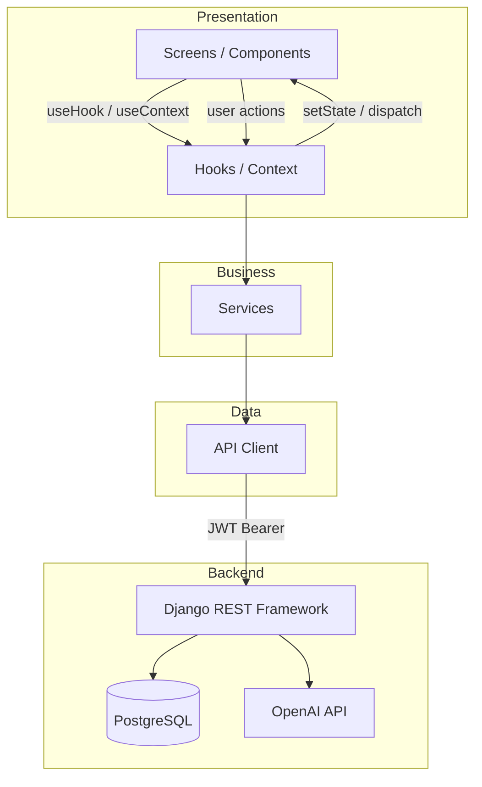
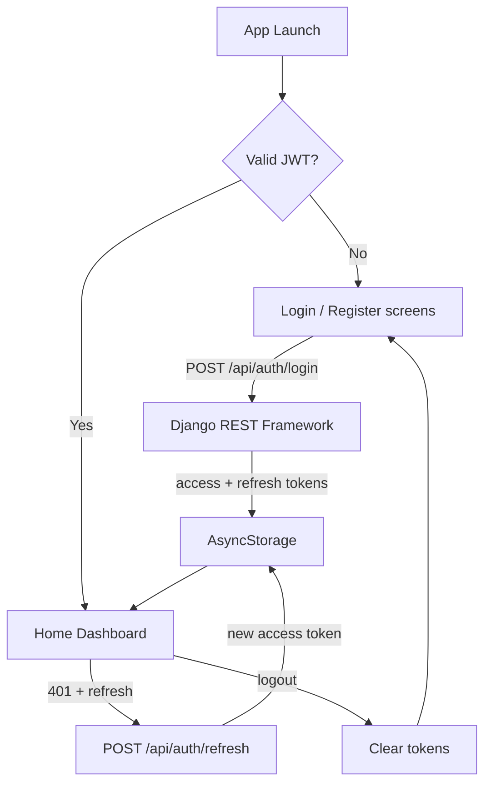
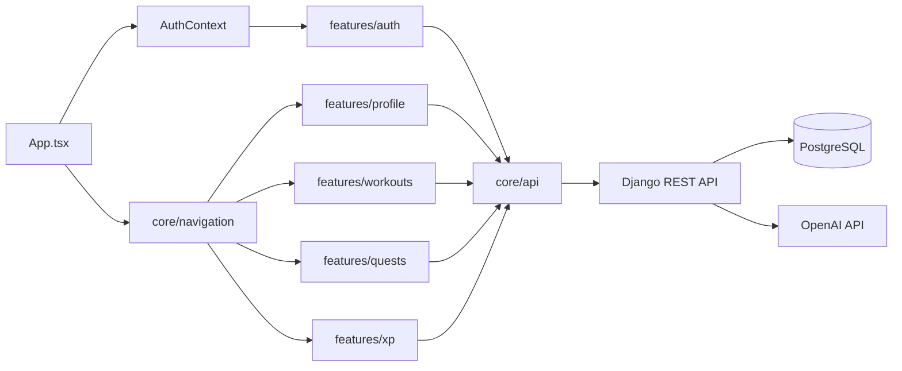
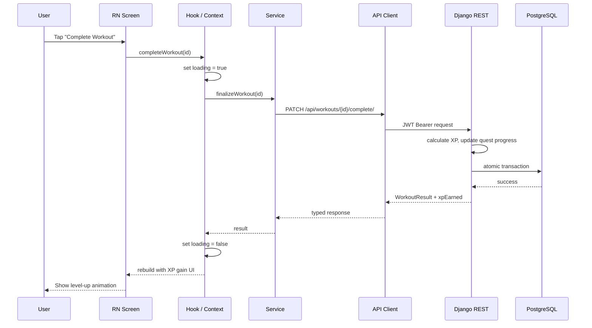

# Architecture

> **Last verified against source code:** 2026-06-23  
> **Source of truth:** Ascension System specification  
> **Stack:** React Native + TypeScript (mobile) · Python + Django + DRF (backend) · PostgreSQL · JWT · OpenAI API  
> **Current state:** Architecture defined; application code not yet scaffolded.

---

## Folder Structure Tree

### Current (Implemented)

```
AscendFit/
└── docs/
    ├── AI_CONTEXT.md
    ├── PROJECT_OVERVIEW.md
    ├── ARCHITECTURE.md
    ├── DATABASE_SCHEMA.md
    ├── API_DOCUMENTATION.md
    ├── UI_SCREENS.md
    ├── FEATURES.md
    ├── CURRENT_PROGRESS.md
    ├── NEXT_TASKS.md
    ├── CHANGELOG.md
    └── DECISIONS.md
```

### Target Application Structure (Planned — Not Yet Created)

```
AscendFit/
├── backend/                            # Django + DRF API
│   ├── manage.py
│   ├── requirements.txt
│   ├── ascendfit/                      # Project settings package
│   │   ├── settings/
│   │   │   ├── base.py
│   │   │   ├── development.py
│   │   │   └── production.py
│   │   ├── urls.py
│   │   └── wsgi.py
│   ├── apps/
│   │   ├── accounts/                   # User, profile, JWT auth
│   │   │   ├── models.py
│   │   │   ├── serializers.py
│   │   │   ├── views.py
│   │   │   ├── services.py
│   │   │   └── urls.py
│   │   ├── workouts/                   # Workout sessions, exercises
│   │   ├── exercises/                  # Global exercise catalog
│   │   ├── gamification/               # XP, levels, quests
│   │   └── ai/                         # OpenAI workout generation proxy
│   ├── media/                          # User uploads (dev)
│   └── tests/
│
├── mobile/                             # React Native + TypeScript
│   ├── src/
│   │   ├── App.tsx                     # Root component, providers
│   │   ├── core/                       # App-wide infrastructure
│   │   │   ├── api/                    # Axios/fetch client, JWT interceptors
│   │   │   ├── auth/                   # Token storage, refresh logic
│   │   │   ├── navigation/             # React Navigation config
│   │   │   ├── theme/                  # Colors, typography
│   │   │   └── utils/                  # Helpers, validators
│   │   ├── shared/                     # Cross-feature shared code
│   │   │   ├── components/             # Reusable UI components
│   │   │   ├── hooks/                  # Shared hooks
│   │   │   └── types/                  # Shared TypeScript types
│   │   └── features/                   # Feature-first modules
│   │       ├── auth/
│   │       │   ├── screens/
│   │       │   ├── components/
│   │       │   ├── hooks/
│   │       │   ├── services/
│   │       │   └── types/
│   │       ├── profile/
│   │       ├── workouts/
│   │       ├── exercises/
│   │       ├── xp/
│   │       ├── quests/
│   │       └── notifications/
│   ├── package.json
│   └── tsconfig.json
│
├── docs/
├── docker-compose.yml                  # PostgreSQL + backend (planned)
├── .env.example
├── .gitignore
└── README.md
```

---

## Module Explanations

### Mobile (`mobile/src/`)

| Module | Purpose |
|--------|---------|
| `core/api/` | HTTP client, base URL, JWT attach/refresh interceptors |
| `core/auth/` | AsyncStorage token persistence, auth state |
| `core/navigation/` | Stack/tab navigators, auth guards |
| `shared/components/` | Reusable UI (XP bar, loading, error banner) |
| `features/*/` | Self-contained feature modules (screens, hooks, services, types) |
| `features/*/services/` | Business logic orchestration — calls API client, no direct fetch in screens |
| `features/*/hooks/` | Feature state and side effects |

### Backend (`backend/apps/`)

| Django App | Purpose |
|------------|---------|
| `accounts` | User model extension, profile, registration, JWT endpoints |
| `workouts` | Workout CRUD, active session, completion flow |
| `exercises` | Global exercise catalog (read-only for users) |
| `gamification` | XP transactions, levels, quest templates, quest progress |
| `ai` | OpenAI API proxy for workout generation |

| Layer | Responsibility |
|-------|----------------|
| `views.py` / ViewSets | HTTP handling, permissions, queryset scoping |
| `serializers.py` | Request/response validation and transformation |
| `services.py` | Business rules (XP calculation, quest validation, OpenAI calls) |
| `models.py` | PostgreSQL schema via Django ORM |

---

## State Management Architecture (Mobile)



### State Boundaries

| Scope | Mechanism | Responsibility |
|-------|-----------|----------------|
| App-wide | `AuthContext` | JWT tokens, user session, login/logout |
| App-wide | `ThemeContext` (optional) | Theme mode |
| Feature | Custom hooks | Workout list, active session state |
| Feature | Custom hooks | Profile, level, XP display |
| Feature | Custom hooks | Daily quests, completion state |
| Feature | Custom hooks | XP transactions, level calculations |

### Rules

- **Screens** consume hooks/context — no direct `fetch` or axios calls.
- **Hooks** delegate to services; handle loading/error state.
- **Services** contain client-side orchestration — no UI state.
- **API client** attaches JWT, handles 401 refresh, maps errors.

---

## Backend Architecture (Django + DRF)

| Component | Role |
|-----------|------|
| **Django ORM** | PostgreSQL access, migrations, transactions |
| **DRF ViewSets** | REST endpoints with permission classes |
| **JWT (simplejwt)** | Access/refresh token issue and validation |
| **Django Services** | XP math, quest validation, OpenAI proxy |
| **PostgreSQL** | Primary data store |
| **OpenAI API** | AI workout generation (server-side only) |
| **Media storage** | Avatar uploads via `ImageField` |

### Authentication Flow



---

## Dependency Graph



---

## Data Flow



---

## Service Layer

### Mobile Services

| Service | Feature | Responsibility |
|---------|---------|----------------|
| `AuthService` | auth | Login, register, logout, token refresh |
| `ProfileService` | profile | Load/update profile, avatar upload |
| `WorkoutService` | workouts | CRUD workouts, finalize session |
| `ExerciseService` | exercises | Fetch catalog, search/filter |
| `XPService` | xp | Display XP, level from API data |
| `QuestService` | quests | Fetch quests, track progress, claim |
| `AIService` | ai | Request AI-generated workout plan |
| `NotificationService` | notifications | Device token registration |

### Backend Services

| Service | App | Responsibility |
|---------|-----|----------------|
| `AuthService` | accounts | User creation, password validation |
| `ProfileService` | accounts | Profile CRUD, avatar handling |
| `WorkoutService` | workouts | CRUD, completion, duration calculation |
| `XPService` | gamification | XP award, level-up, transaction log |
| `QuestService` | gamification | Daily assignment, progress, claim |
| `OpenAIService` | ai | Prompt construction, API call, response parse |

---

## API Client Layer (Mobile)

| Client Module | Backend Endpoints |
|---------------|-------------------|
| `authApi` | `/api/auth/register/`, `/api/auth/login/`, `/api/auth/refresh/` |
| `profileApi` | `/api/profile/` |
| `workoutApi` | `/api/workouts/` |
| `exerciseApi` | `/api/exercises/` |
| `xpApi` | `/api/xp/transactions/` |
| `questApi` | `/api/quests/` |
| `aiApi` | `/api/ai/generate-workout/` |

---

## Testing Strategy (Planned)

| Layer | Approach |
|-------|----------|
| Backend services | pytest + Django TestCase with mocked OpenAI |
| Backend views | DRF APITestCase with JWT auth |
| Mobile services | Jest unit tests with mocked API client |
| Mobile screens | React Native Testing Library |
| Integration | Detox or Maestro (mobile); pytest against test DB (backend) |

---

## Frontend Architecture (React Native)

| Concern | Approach |
|---------|----------|
| **Navigation** | React Navigation with auth stack / main tab navigator |
| **Theming** | Central theme in `core/theme/` |
| **Forms** | Validators in `core/utils/` |
| **Error handling** | Hook error state + toast/Snackbar |
| **Offline** | Optional: cache last-fetched data in AsyncStorage (post-MVP) |
| **Platform priority** | Android first; iOS maintained for future scaling |
