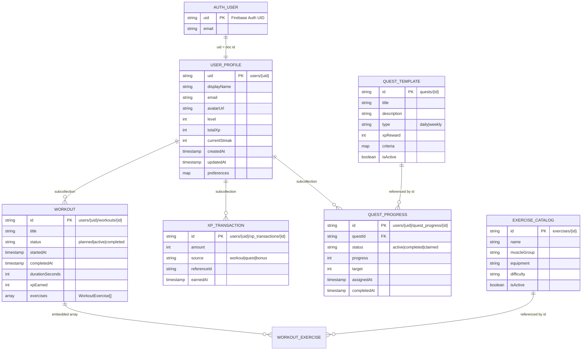

# Database Schema

> **Database:** Cloud Firestore  
> **Last verified against source code:** 2026-06-23  
> **Current state:** Schema designed; Firestore collections not yet created in Firebase project or Dart models.

---

## Overview

AscendFit uses **Cloud Firestore** as its primary data store. Data is organized in top-level collections and user-scoped subcollections keyed by Firebase Auth `uid`.

Security is enforced via **Firestore Security Rules** — users may only read/write their own documents unless explicitly public (e.g., exercise catalog).

---

## Entity Relationship Diagram



---

## Collections

### `users/{uid}`

User profile document. Document ID matches Firebase Auth UID.

| Field | Type | Constraints | Description |
|-------|------|-------------|-------------|
| `uid` | string | Required, = doc ID | Firebase Auth UID |
| `email` | string | Required | User email |
| `displayName` | string | Optional | Display name |
| `avatarUrl` | string | Optional | Firebase Storage URL |
| `level` | int | Default: 1 | Current level |
| `totalXp` | int | Default: 0 | Lifetime XP |
| `currentStreak` | int | Default: 0 | Consecutive workout days |
| `longestStreak` | int | Default: 0 | Best streak record |
| `preferences` | map | Optional | `{ units: 'metric', notificationsEnabled: true }` |
| `fcmToken` | string | Optional | Latest FCM device token |
| `createdAt` | timestamp | Required | Profile creation time |
| `updatedAt` | timestamp | Required | Last profile update |

**Relationships:** Parent of `workouts`, `xp_transactions`, `quest_progress` subcollections.

**Indexes:** None required for direct document read by UID.

**Security Rule (planned):**
```
match /users/{userId} {
  allow read, write: if request.auth != null && request.auth.uid == userId;
}
```

**Example Record:**
```json
{
  "uid": "abc123firebaseuid",
  "email": "user@example.com",
  "displayName": "Alex Trainer",
  "avatarUrl": "https://firebasestorage.googleapis.com/.../avatar.jpg",
  "level": 5,
  "totalXp": 1250,
  "currentStreak": 7,
  "longestStreak": 14,
  "preferences": {
    "units": "metric",
    "notificationsEnabled": true
  },
  "createdAt": "2026-06-01T08:00:00Z",
  "updatedAt": "2026-06-23T10:30:00Z"
}
```

---

### `users/{uid}/workouts/{workoutId}`

User workout sessions (subcollection).

| Field | Type | Constraints | Description |
|-------|------|-------------|-------------|
| `id` | string | = doc ID | Workout document ID |
| `title` | string | Required | Workout name |
| `status` | string | `planned`, `active`, `completed` | Session state |
| `startedAt` | timestamp | Optional | When session started |
| `completedAt` | timestamp | Optional | When session finished |
| `durationSeconds` | int | Optional | Total duration |
| `xpEarned` | int | Default: 0 | XP awarded on completion |
| `exercises` | array | Optional | Embedded exercise entries |
| `notes` | string | Optional | User notes |
| `createdAt` | timestamp | Required | Creation time |
| `updatedAt` | timestamp | Required | Last update |

**Embedded `exercises[]` item:**

| Field | Type | Description |
|-------|------|-------------|
| `exerciseId` | string | Reference to `exercises/{id}` |
| `name` | string | Denormalized exercise name |
| `sets` | array | `{ reps, weight, completed }` |

**Indexes (planned):**
- `status` + `createdAt` DESC (list user workouts by status)

**Example Record:**
```json
{
  "id": "workout_001",
  "title": "Push Day",
  "status": "completed",
  "startedAt": "2026-06-23T07:00:00Z",
  "completedAt": "2026-06-23T07:45:00Z",
  "durationSeconds": 2700,
  "xpEarned": 75,
  "exercises": [
    {
      "exerciseId": "ex_bench_press",
      "name": "Bench Press",
      "sets": [
        { "reps": 10, "weight": 60, "completed": true },
        { "reps": 8, "weight": 65, "completed": true }
      ]
    }
  ],
  "createdAt": "2026-06-23T06:55:00Z",
  "updatedAt": "2026-06-23T07:45:00Z"
}
```

---

### `exercises/{exerciseId}`

Global exercise catalog (read-only for users, admin-write).

| Field | Type | Constraints | Description |
|-------|------|-------------|-------------|
| `id` | string | = doc ID | Exercise ID |
| `name` | string | Required | Exercise name |
| `muscleGroup` | string | Required | e.g., `chest`, `legs` |
| `equipment` | string | Optional | e.g., `barbell`, `bodyweight` |
| `difficulty` | string | Optional | `beginner`, `intermediate`, `advanced` |
| `instructions` | string | Optional | How-to text |
| `isActive` | boolean | Default: true | Soft delete flag |

**Indexes (planned):**
- `muscleGroup` + `name` ASC
- `isActive` + `name` ASC

**Security Rule (planned):**
```
match /exercises/{exerciseId} {
  allow read: if request.auth != null;
  allow write: if false; // Admin via Cloud Functions or console only
}
```

**Example Record:**
```json
{
  "id": "ex_bench_press",
  "name": "Bench Press",
  "muscleGroup": "chest",
  "equipment": "barbell",
  "difficulty": "intermediate",
  "instructions": "Lie flat on bench, lower bar to chest, press up.",
  "isActive": true
}
```

---

### `users/{uid}/xp_transactions/{transactionId}`

XP earn history (subcollection).

| Field | Type | Constraints | Description |
|-------|------|-------------|-------------|
| `id` | string | = doc ID | Transaction ID |
| `amount` | int | Required | XP earned (positive) |
| `source` | string | `workout`, `quest`, `bonus`, `streak` | Origin type |
| `referenceId` | string | Optional | Related workout/quest ID |
| `description` | string | Optional | Human-readable label |
| `earnedAt` | timestamp | Required | When XP was earned |

**Indexes (planned):**
- `earnedAt` DESC (XP history timeline)

**Example Record:**
```json
{
  "id": "xp_001",
  "amount": 75,
  "source": "workout",
  "referenceId": "workout_001",
  "description": "Completed Push Day",
  "earnedAt": "2026-06-23T07:45:00Z"
}
```

---

### `quests/{questId}`

Global quest templates (admin-defined, user-readable).

| Field | Type | Constraints | Description |
|-------|------|-------------|-------------|
| `id` | string | = doc ID | Quest template ID |
| `title` | string | Required | Quest title |
| `description` | string | Required | Quest description |
| `type` | string | `daily`, `weekly` | Quest cadence |
| `xpReward` | int | Required | XP on completion |
| `criteria` | map | Required | `{ type: 'complete_workout', target: 1 }` |
| `isActive` | boolean | Default: true | Available for assignment |

**Example Record:**
```json
{
  "id": "quest_daily_workout",
  "title": "Daily Grind",
  "description": "Complete 1 workout today",
  "type": "daily",
  "xpReward": 50,
  "criteria": { "type": "complete_workout", "target": 1 },
  "isActive": true
}
```

---

### `users/{uid}/quest_progress/{progressId}`

Per-user quest assignment and progress (subcollection).

| Field | Type | Constraints | Description |
|-------|------|-------------|-------------|
| `id` | string | = doc ID | Progress document ID |
| `questId` | string | Required | Reference to `quests/{id}` |
| `title` | string | Required | Denormalized quest title |
| `status` | string | `active`, `completed`, `claimed` | Progress state |
| `progress` | int | Default: 0 | Current progress count |
| `target` | int | Required | Goal to complete |
| `xpReward` | int | Required | Denormalized reward |
| `assignedAt` | timestamp | Required | When quest was assigned |
| `completedAt` | timestamp | Optional | When target was met |
| `claimedAt` | timestamp | Optional | When reward was claimed |

**Indexes (planned):**
- `status` + `assignedAt` DESC

**Example Record:**
```json
{
  "id": "qp_20260623_001",
  "questId": "quest_daily_workout",
  "title": "Daily Grind",
  "status": "completed",
  "progress": 1,
  "target": 1,
  "xpReward": 50,
  "assignedAt": "2026-06-23T00:00:00Z",
  "completedAt": "2026-06-23T07:45:00Z"
}
```

---

## Firebase Storage Paths

| Path | Purpose | Access |
|------|---------|--------|
| `users/{uid}/avatar.jpg` | Profile avatar | Owner read/write |
| `users/{uid}/workouts/{workoutId}/media/{file}` | Workout media (future) | Owner read/write |

---

## Level Calculation (Planned Business Logic)

Documented here for schema context; implemented in `XPService`:

| Level | XP Required (cumulative) |
|-------|--------------------------|
| 1 | 0 |
| 2 | 100 |
| 3 | 250 |
| 4 | 500 |
| 5 | 850 |
| n | TBD — formula in ADR-016 |

> Update this table when XP formula is finalized in `DECISIONS.md`.

---

## Migration & Seeding Strategy

| Task | Approach |
|------|----------|
| Exercise catalog | Seed script via Firebase Admin SDK or console import |
| Quest templates | Seed script; daily assignment via client or Cloud Function |
| Schema changes | Firestore is schemaless — document field additions; use `updatedAt` for tracking |
| Local development | Firebase Emulator Suite (Auth, Firestore, Storage) |

---

## Notes

- **Not yet implemented in code** — update this document when Dart models and Firestore rules are added.
- Denormalize frequently displayed fields (quest title, exercise name) to reduce reads.
- Use Firestore batch writes when completing workouts + awarding XP atomically.
