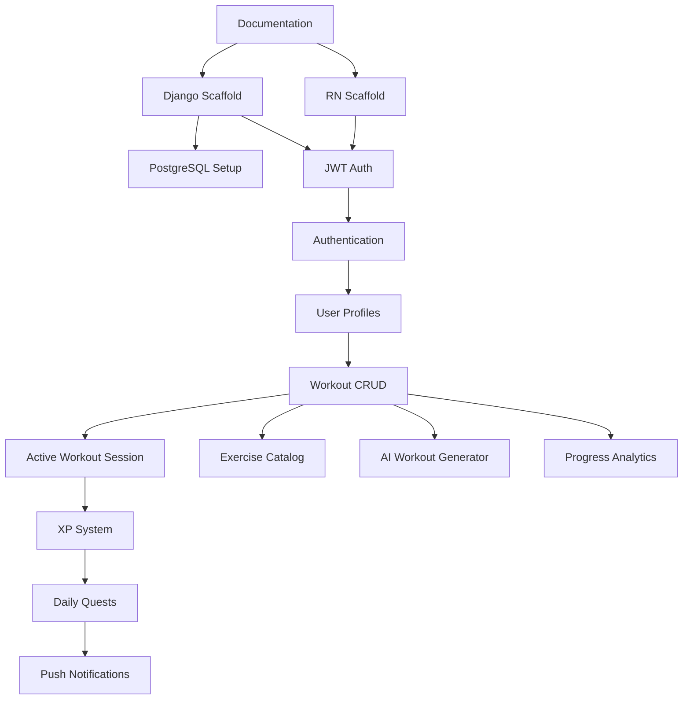

# Features

> **Last verified against source code:** 2026-06-23  
> **Source of truth:** Ascension System specification  
> **Stack:** React Native + TypeScript · Django + DRF · PostgreSQL · JWT · OpenAI API

---

## Implemented

| Feature | Description | Status | Dependencies |
|---------|-------------|--------|--------------|
| Project documentation system | Full `/docs` governance with 11 files | Complete | None |
| Tech stack selection | React Native, Django, DRF, PostgreSQL, JWT, OpenAI | Complete | Documented in `DECISIONS.md` |
| PostgreSQL schema design | Tables, fields, relationships | Designed | Not migrated |
| REST API surface design | DRF endpoints, JWT auth, OpenAI proxy | Designed | Not coded |
| UI screen catalog | Routes and navigation flow defined | Designed | Not coded |

---

## In Progress

| Feature | Description | Completion % |
|---------|-------------|--------------|
| MVP scope definition | Confirm v1.0 feature set per Ascension System | 20% |
| Backend project setup | Django + DRF + PostgreSQL | 0% |
| Mobile project scaffolding | React Native + TypeScript feature-first structure | 0% |

---

## Planned

### P0 — Foundation (Sprint 0–1)

| Feature | Description | Priority |
|---------|-------------|----------|
| Git initialization | Version control with conventional commits | **P0** |
| Django project scaffold | `django-admin startproject`, apps, requirements.txt | **P0** |
| PostgreSQL setup | Docker Compose + Django DATABASES config | **P0** |
| React Native project scaffold | TypeScript template, folder structure | **P0** |
| JWT authentication setup | djangorestframework-simplejwt + mobile token storage | **P0** |
| App theme & navigation shell | React Navigation, tab navigator | **P0** |

### P1 — MVP Core

| Feature | Description | Priority |
|---------|-------------|----------|
| Authentication | Register, login, logout, password reset (JWT) | **P1** |
| User profiles | Profile CRUD, avatar upload via DRF | **P1** |
| Workout CRUD | Create, list, view, edit, delete workouts | **P1** |
| Active workout session | In-session logging, timer, finish flow | **P1** |
| Exercise catalog | PostgreSQL exercise library + search API | **P1** |
| XP system | XP on workout completion, level display | **P1** |
| Daily quests | Assign, track, claim daily quests | **P1** |
| AI workout generator | OpenAI API via Django backend proxy | **P1** |

### P2 — Engagement

| Feature | Description | Priority |
|---------|-------------|----------|
| Push notifications | Backend-triggered quest reminders | **P2** |
| Streak tracking | Consecutive workout day counter | **P2** |
| Progress analytics | Charts, personal records, history | **P2** |
| Workout summary screen | Post-session recap with XP animation | **P2** |

### P3 — Growth

| Feature | Description | Priority |
|---------|-------------|----------|
| iOS build & release | Scale from Android-first to iOS | **P3** |
| Social features | Leaderboards, sharing | **P4** |
| Celery scheduled tasks | Daily quest assignment, notification jobs | **P3** |
| Admin dashboard | Django admin enhancements | **P3** |

---

## Feature Dependency Map

---

## Feature ↔ Module Mapping

| Feature | Mobile Module | Backend App | Services |
|---------|---------------|-------------|----------|
| Authentication | `features/auth/` | `accounts` | JWT, DRF auth views |
| User profiles | `features/profile/` | `accounts` | PostgreSQL, media storage |
| Workouts | `features/workouts/` | `workouts` | PostgreSQL |
| Exercise catalog | `features/exercises/` | `exercises` | PostgreSQL |
| XP system | `features/xp/` | `gamification` | PostgreSQL |
| Daily quests | `features/quests/` | `gamification` | PostgreSQL |
| AI workouts | `features/ai/` | `ai` | OpenAI API |
| Notifications | `features/notifications/` | `accounts` | FCM/APNs (planned) |

---

## Notes

- Update status columns when features move between Implemented, In Progress, and Planned.
- Cross-reference `UI_SCREENS.md` for screen-level detail and `DATABASE_SCHEMA.md` for data models.
- AI workout generation is **in MVP scope** — proxied via Django, not client-side OpenAI calls.
