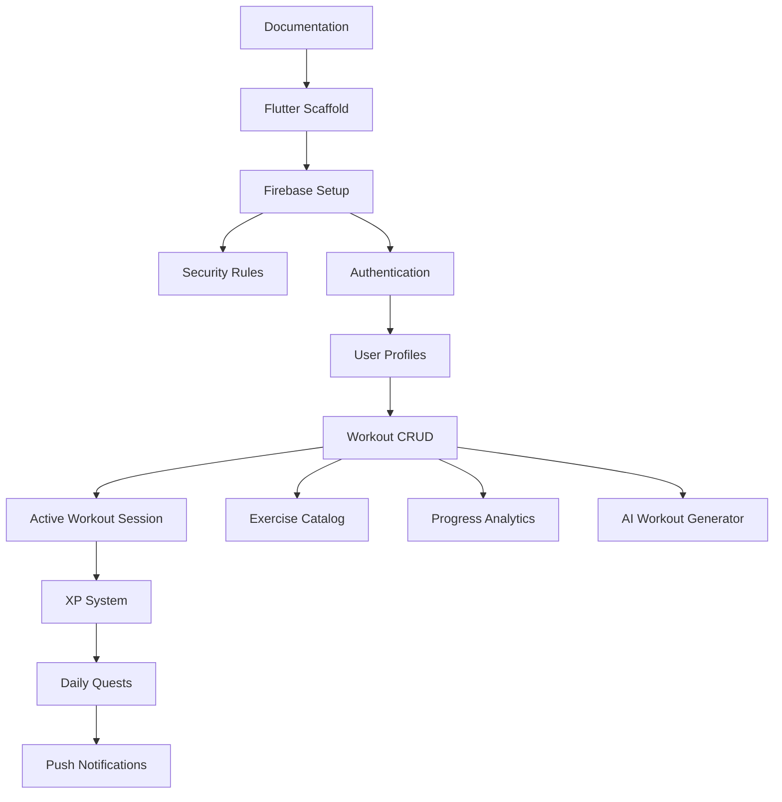

# Features

> **Last verified against source code:** 2026-06-23  
> **Stack:** Flutter + Firebase + Provider

---

## Implemented

| Feature | Description | Status | Dependencies |
|---------|-------------|--------|--------------|
| Project documentation system | Full `/docs` governance with 11 files | Complete | None |
| Tech stack selection | Flutter, Firebase, Provider, feature-first architecture | Complete | Documented in `DECISIONS.md` |
| Firestore schema design | Collections, fields, security rules plan | Designed | Not deployed |
| UI screen catalog | Routes and navigation flow defined | Designed | Not coded |

---

## In Progress

| Feature | Description | Completion % |
|---------|-------------|--------------|
| MVP scope definition | Confirm v1.0 feature set | 20% |
| Firebase project setup | Create and link Firebase project | 0% |
| Flutter project scaffolding | Initialize app with feature-first structure | 0% |

---

## Planned

### P0 — Foundation (Sprint 0–1)

| Feature | Description | Priority |
|---------|-------------|----------|
| Git initialization | Version control with conventional commits | **P0** |
| Flutter project scaffold | `flutter create`, folder structure, pubspec | **P0** |
| Firebase integration | FlutterFire CLI, Auth, Firestore, Storage, FCM | **P0** |
| Firestore security rules | User-scoped read/write rules | **P0** |
| App theme & routing shell | Material 3 theme, go_router, bottom nav | **P0** |

### P1 — MVP Core

| Feature | Description | Priority |
|---------|-------------|----------|
| Authentication | Email/password register, login, logout, reset | **P1** |
| User profiles | Firestore profile create/load, avatar upload | **P1** |
| Workout CRUD | Create, list, view, edit, delete workouts | **P1** |
| Active workout session | In-session logging, timer, finish flow | **P1** |
| Exercise catalog | Global Firestore exercise library + search | **P1** |
| XP system | XP on workout completion, level display | **P1** |
| Daily quests | Assign, track, claim daily quests | **P1** |

### P2 — Engagement

| Feature | Description | Priority |
|---------|-------------|----------|
| Push notifications | FCM quest reminders, streak nudges | **P2** |
| Streak tracking | Consecutive workout day counter | **P2** |
| Progress analytics | Charts, personal records, history | **P2** |
| Workout summary screen | Post-session recap with XP animation | **P2** |

### P3 — Intelligence & Growth

| Feature | Description | Priority |
|---------|-------------|----------|
| AI workout generator | Cloud Function + LLM integration | **P3** |
| iOS build & release | Scale from Android-first to iOS | **P3** |
| Social features | Leaderboards, sharing | **P4** |
| Cloud Functions | Scheduled quests, server-side XP validation | **P3** |

---

## Feature Dependency Map

---

## Feature ↔ Module Mapping

| Feature | Flutter Module | Firebase Services |
|---------|----------------|-------------------|
| Authentication | `features/auth/` | Firebase Auth |
| User profiles | `features/profile/` | Firestore, Storage |
| Workouts | `features/workouts/` | Firestore |
| Exercise catalog | `features/exercises/` | Firestore |
| XP system | `features/xp/` | Firestore |
| Daily quests | `features/quests/` | Firestore |
| Notifications | `features/notifications/` | FCM, Firestore |

---

## Notes

- Update status columns when features move between Implemented, In Progress, and Planned.
- Cross-reference `UI_SCREENS.md` for screen-level detail and `DATABASE_SCHEMA.md` for data models.
