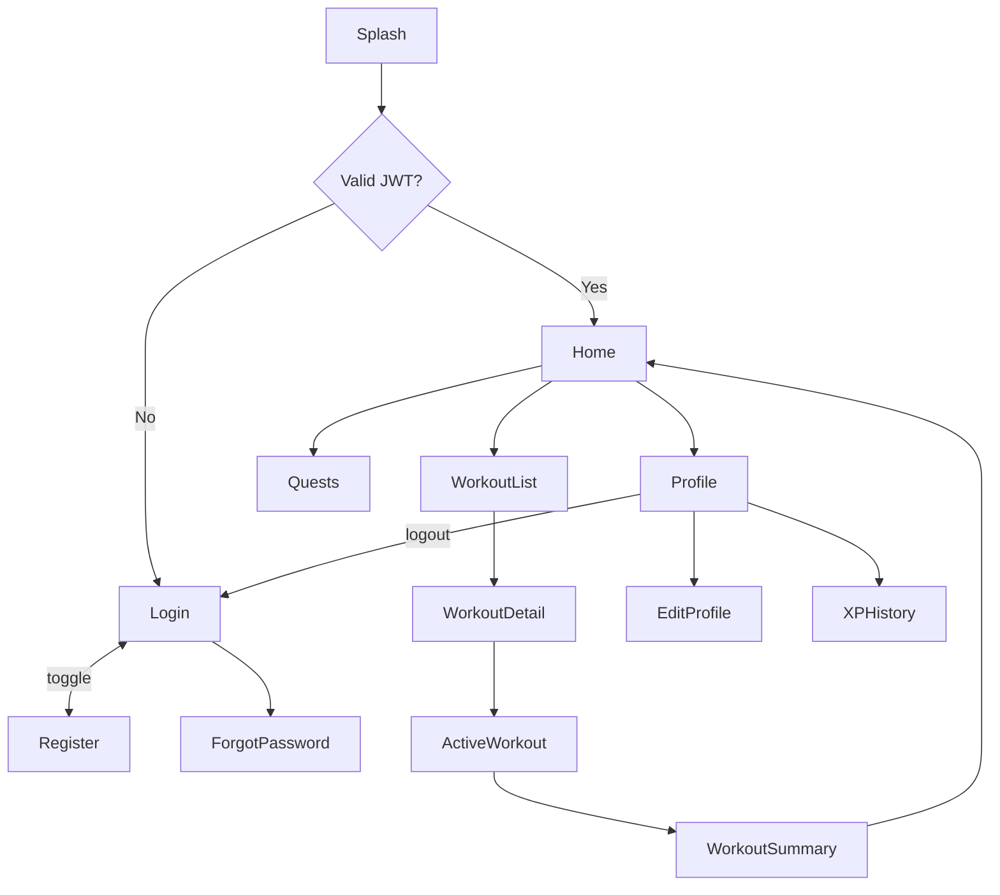

# UI Screens

> **Platform:** React Native + TypeScript (Android first)  
> **Navigation:** React Navigation (planned)  
> **State:** React Context + custom hooks  
> **API:** Django REST Framework + JWT  
> **Last verified against source code:** 2026-06-23  
> **Source of truth:** Ascension System specification  
> **Current state:** Screen catalog defined; no React Native screens implemented yet.

---

## Screen Inventory

| Screen | Route | Feature Module | Status |
|--------|-------|----------------|--------|
| Splash | `Splash` | core | Planned |
| Onboarding | `Onboarding` | auth | Planned |
| Login | `Login` | auth | Planned |
| Register | `Register` | auth | Planned |
| Forgot Password | `ForgotPassword` | auth | Planned |
| Home / Dashboard | `Home` | profile | Planned |
| Workout List | `WorkoutList` | workouts | Planned |
| Workout Detail | `WorkoutDetail` | workouts | Planned |
| Active Workout | `ActiveWorkout` | workouts | Planned |
| Workout Summary | `WorkoutSummary` | workouts | Planned |
| Exercise Catalog | `ExerciseCatalog` | exercises | Planned |
| Quests | `Quests` | quests | Planned |
| Profile | `Profile` | profile | Planned |
| Edit Profile | `EditProfile` | profile | Planned |
| XP History | `XPHistory` | xp | Planned |
| Settings | `Settings` | profile | Planned |
| AI Workout Generator | `AIWorkout` | ai | Planned |

---

## Screen Details

### Splash

| Attribute | Value |
|-----------|-------|
| **Purpose** | Check stored JWT, validate/refresh token, route accordingly |
| **Route** | `Splash` (initial route) |
| **File (planned)** | `mobile/src/core/navigation/SplashScreen.tsx` |
| **Components** | App logo, loading indicator |
| **Hooks / Context** | `AuthContext` |
| **User actions** | None (auto-navigate) |
| **Navigation** | → Onboarding (first launch), Login (no token), Home (valid token) |

---

### Onboarding

| Attribute | Value |
|-----------|-------|
| **Purpose** | Introduce app value; collect fitness goals |
| **Route** | `Onboarding` |
| **File (planned)** | `mobile/src/features/auth/screens/OnboardingScreen.tsx` |
| **Components** | FlatList/ScrollView carousel, goal selection chips, CTA button |
| **Hooks / Context** | Local state; AsyncStorage for completion flag |
| **User actions** | Skip, Continue, Select goals |
| **Navigation** | → Register, Home |

---

### Login

| Attribute | Value |
|-----------|-------|
| **Purpose** | Authenticate via JWT login endpoint |
| **Route** | `Login` |
| **File (planned)** | `mobile/src/features/auth/screens/LoginScreen.tsx` |
| **Components** | Email field, password field, login button, register link |
| **Hooks / Context** | `AuthContext`, `useAuth` |
| **User actions** | Sign in, Go to register, Forgot password |
| **Navigation** | → Home, Register, ForgotPassword |
| **API** | `POST /api/auth/login/` |

---

### Register

| Attribute | Value |
|-----------|-------|
| **Purpose** | Create account via DRF register endpoint |
| **Route** | `Register` |
| **File (planned)** | `mobile/src/features/auth/screens/RegisterScreen.tsx` |
| **Components** | Name, email, password, confirm password, register button |
| **Hooks / Context** | `AuthContext` |
| **User actions** | Create account |
| **Navigation** | → Home, Login |
| **API** | `POST /api/auth/register/` |

---

### Forgot Password

| Attribute | Value |
|-----------|-------|
| **Purpose** | Trigger password reset email via DRF |
| **Route** | `ForgotPassword` |
| **File (planned)** | `mobile/src/features/auth/screens/ForgotPasswordScreen.tsx` |
| **Components** | Email field, submit button, back link |
| **Hooks / Context** | `useAuth` |
| **User actions** | Send reset email |
| **Navigation** | → Login |
| **API** | `POST /api/auth/password-reset/` |

---

### Home / Dashboard

| Attribute | Value |
|-----------|-------|
| **Purpose** | Central hub — XP, streak, daily quests, quick actions |
| **Route** | `Home` (tab) |
| **File (planned)** | `mobile/src/features/profile/screens/HomeScreen.tsx` |
| **Components** | XP bar, level badge, streak counter, quest cards, FAB (start workout) |
| **Hooks / Context** | `useProfile`, `useQuests`, `useWorkouts` |
| **User actions** | Start workout, View quests, Open profile |
| **Navigation** | → WorkoutList, Quests, Profile, ActiveWorkout |

---

### Workout List

| Attribute | Value |
|-----------|-------|
| **Purpose** | Browse planned, active, and completed workouts |
| **Route** | `WorkoutList` (tab) |
| **File (planned)** | `mobile/src/features/workouts/screens/WorkoutListScreen.tsx` |
| **Components** | Tab filter (planned/active/completed), workout cards, FAB |
| **Hooks / Context** | `useWorkouts` |
| **User actions** | Open workout, Create workout, Delete |
| **Navigation** | → WorkoutDetail, ActiveWorkout |

---

### Workout Detail

| Attribute | Value |
|-----------|-------|
| **Purpose** | View/edit workout plan before or after session |
| **Route** | `WorkoutDetail` |
| **File (planned)** | `mobile/src/features/workouts/screens/WorkoutDetailScreen.tsx` |
| **Components** | Exercise list, set editor, start/finish buttons |
| **Hooks / Context** | `useWorkouts`, `useExercises` |
| **User actions** | Add exercise, Edit sets, Start, Delete |
| **Navigation** | → ActiveWorkout, WorkoutList |

---

### Active Workout

| Attribute | Value |
|-----------|-------|
| **Purpose** | In-session logging with timer |
| **Route** | `ActiveWorkout` |
| **File (planned)** | `mobile/src/features/workouts/screens/ActiveWorkoutScreen.tsx` |
| **Components** | Timer, exercise stepper, set checkboxes, rest timer, finish CTA |
| **Hooks / Context** | `useWorkouts`, `useXP` |
| **User actions** | Log set, Skip exercise, Finish workout |
| **Navigation** | → WorkoutSummary |
| **API** | `POST /api/workouts/{id}/complete/` |

---

### Workout Summary

| Attribute | Value |
|-----------|-------|
| **Purpose** | Post-workout recap with XP earned |
| **Route** | `WorkoutSummary` |
| **File (planned)** | `mobile/src/features/workouts/screens/WorkoutSummaryScreen.tsx` |
| **Components** | Stats summary, XP animation, quest progress update |
| **Hooks / Context** | `useWorkouts`, `useXP`, `useQuests` |
| **User actions** | Done, Share (future) |
| **Navigation** | → Home |

---

### Quests

| Attribute | Value |
|-----------|-------|
| **Purpose** | View and complete daily/weekly quests |
| **Route** | `Quests` (tab) |
| **File (planned)** | `mobile/src/features/quests/screens/QuestsScreen.tsx` |
| **Components** | Quest cards, progress bars, claim button |
| **Hooks / Context** | `useQuests`, `useXP` |
| **User actions** | Claim reward, View details |
| **Navigation** | → Home, relevant feature screens |
| **API** | `POST /api/quests/{id}/claim/` |

---

### Profile

| Attribute | Value |
|-----------|-------|
| **Purpose** | User stats, level, avatar, settings entry |
| **Route** | `Profile` (tab) |
| **File (planned)** | `mobile/src/features/profile/screens/ProfileScreen.tsx` |
| **Components** | Avatar, level/XP display, streak stats, menu tiles |
| **Hooks / Context** | `useProfile`, `AuthContext`, `useXP` |
| **User actions** | Edit profile, View XP history, Settings, Logout |
| **Navigation** | → EditProfile, XPHistory, Settings, Login |

---

### Edit Profile

| Attribute | Value |
|-----------|-------|
| **Purpose** | Update display name and avatar |
| **Route** | `EditProfile` |
| **File (planned)** | `mobile/src/features/profile/screens/EditProfileScreen.tsx` |
| **Components** | Avatar picker, name field, save button |
| **Hooks / Context** | `useProfile` |
| **User actions** | Change avatar, Save profile |
| **Navigation** | → Profile |
| **API** | `PATCH /api/profile/`, `POST /api/profile/avatar/` |

---

### XP History

| Attribute | Value |
|-----------|-------|
| **Purpose** | Timeline of XP transactions |
| **Route** | `XPHistory` |
| **File (planned)** | `mobile/src/features/xp/screens/XPHistoryScreen.tsx` |
| **Components** | FlatList of transactions, source icons, date headers |
| **Hooks / Context** | `useXP` |
| **User actions** | Scroll history |
| **Navigation** | → Profile |

---

### AI Workout Generator

| Attribute | Value |
|-----------|-------|
| **Purpose** | Generate personalized workout via OpenAI API (backend proxy) |
| **Route** | `AIWorkout` |
| **File (planned)** | `mobile/src/features/ai/screens/AIWorkoutScreen.tsx` |
| **Components** | Goal/duration/equipment form, generate button, result preview |
| **Hooks / Context** | `useAIWorkout` |
| **User actions** | Configure preferences, Generate, Save as workout |
| **Navigation** | → WorkoutDetail |
| **API** | `POST /api/ai/generate-workout/` |

---

## Navigation Flow



---

## Auth Navigation Guards (Planned)

```typescript
// React Navigation auth flow (planned)
// AuthStack: Login, Register, ForgotPassword, Onboarding
// MainTabs: Home, WorkoutList, Quests, Profile
// Root navigator switches based on AuthContext.isAuthenticated
```

---

## Shared Components (Planned)

| Component | Location | Used On |
|-----------|----------|---------|
| `XpBar` | `mobile/src/shared/components/XpBar.tsx` | Home, Profile |
| `LevelBadge` | `mobile/src/shared/components/LevelBadge.tsx` | Home, Profile, Summary |
| `QuestCard` | `mobile/src/features/quests/components/QuestCard.tsx` | Home, Quests |
| `WorkoutCard` | `mobile/src/features/workouts/components/WorkoutCard.tsx` | WorkoutList |
| `LoadingOverlay` | `mobile/src/shared/components/LoadingOverlay.tsx` | All async screens |
| `ErrorBanner` | `mobile/src/shared/components/ErrorBanner.tsx` | All screens |

---

## Bottom Tab Navigation (Planned)

| Tab | Icon | Screen |
|-----|------|--------|
| Home | home | `Home` |
| Workouts | fitness-center | `WorkoutList` |
| Quests | emoji-events | `Quests` |
| Profile | person | `Profile` |

Implemented via `@react-navigation/bottom-tabs` inside authenticated `MainTabs` navigator.
