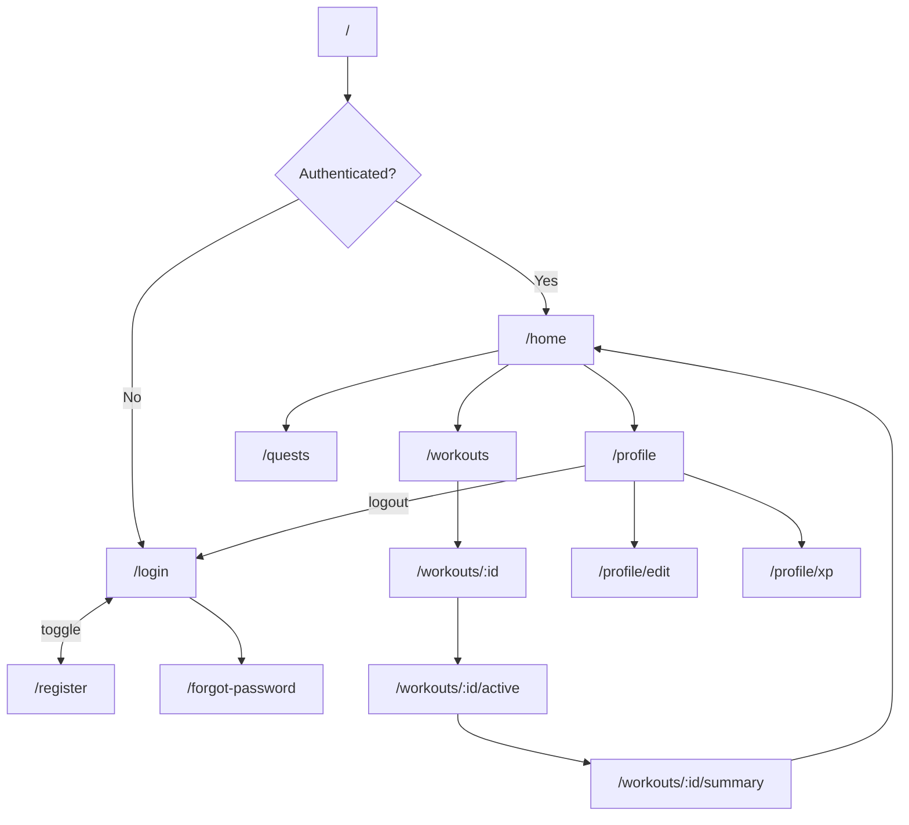

# UI Screens

> **Platform:** Flutter (Android first)  
> **Routing:** go_router (planned)  
> **State:** Provider  
> **Last verified against source code:** 2026-06-23  
> **Current state:** Screen catalog defined; no Flutter screens implemented yet.

---

## Screen Inventory

| Screen | Route | Feature Module | Status |
|--------|-------|----------------|--------|
| Splash | `/` | core | Planned |
| Onboarding | `/onboarding` | auth | Planned |
| Login | `/login` | auth | Planned |
| Register | `/register` | auth | Planned |
| Forgot Password | `/forgot-password` | auth | Planned |
| Home / Dashboard | `/home` | profile | Planned |
| Workout List | `/workouts` | workouts | Planned |
| Workout Detail | `/workouts/:id` | workouts | Planned |
| Active Workout | `/workouts/:id/active` | workouts | Planned |
| Workout Summary | `/workouts/:id/summary` | workouts | Planned |
| Exercise Catalog | `/exercises` | exercises | Planned |
| Quests | `/quests` | quests | Planned |
| Profile | `/profile` | profile | Planned |
| Edit Profile | `/profile/edit` | profile | Planned |
| XP History | `/profile/xp` | xp | Planned |
| Settings | `/settings` | profile | Planned |
| AI Workout Generator | `/ai/workout` | workouts | Planned (post-MVP) |

---

## Screen Details

### Splash

| Attribute | Value |
|-----------|-------|
| **Purpose** | Initialize Firebase, check auth state, route accordingly |
| **Route** | `/` |
| **File (planned)** | `lib/core/routing/` or dedicated splash in `lib/features/auth/presentation/screens/splash_screen.dart` |
| **Components** | App logo, loading indicator |
| **Providers** | `AuthProvider` |
| **User actions** | None (auto-navigate) |
| **Navigation** | → Onboarding (first launch), Login (logged out), Home (logged in) |

---

### Onboarding

| Attribute | Value |
|-----------|-------|
| **Purpose** | Introduce app value; collect fitness goals |
| **Route** | `/onboarding` |
| **File (planned)** | `lib/features/auth/presentation/screens/onboarding_screen.dart` |
| **Components** | PageView carousel, goal selection chips, CTA button |
| **Providers** | Local state / `SharedPreferences` for completion flag |
| **User actions** | Skip, Continue, Select goals |
| **Navigation** | → Register, Home |

---

### Login

| Attribute | Value |
|-----------|-------|
| **Purpose** | Authenticate existing users |
| **Route** | `/login` |
| **File (planned)** | `lib/features/auth/presentation/screens/login_screen.dart` |
| **Components** | Email field, password field, login button, register link |
| **Providers** | `AuthProvider` |
| **User actions** | Sign in, Go to register, Forgot password |
| **Navigation** | → Home, Register, Forgot Password |

---

### Register

| Attribute | Value |
|-----------|-------|
| **Purpose** | Create new Firebase Auth account + Firestore profile |
| **Route** | `/register` |
| **File (planned)** | `lib/features/auth/presentation/screens/register_screen.dart` |
| **Components** | Name, email, password, confirm password, register button |
| **Providers** | `AuthProvider`, `ProfileProvider` |
| **User actions** | Create account |
| **Navigation** | → Home, Login |

---

### Forgot Password

| Attribute | Value |
|-----------|-------|
| **Purpose** | Trigger Firebase password reset email |
| **Route** | `/forgot-password` |
| **File (planned)** | `lib/features/auth/presentation/screens/forgot_password_screen.dart` |
| **Components** | Email field, submit button, back link |
| **Providers** | `AuthProvider` |
| **User actions** | Send reset email |
| **Navigation** | → Login |

---

### Home / Dashboard

| Attribute | Value |
|-----------|-------|
| **Purpose** | Central hub — XP, streak, daily quests, quick actions |
| **Route** | `/home` |
| **File (planned)** | `lib/features/profile/presentation/screens/home_screen.dart` |
| **Components** | XP bar, level badge, streak counter, quest cards, FAB (start workout) |
| **Providers** | `ProfileProvider`, `QuestProvider`, `WorkoutProvider` |
| **User actions** | Start workout, View quests, Open profile |
| **Navigation** | → Workouts, Quests, Profile, Active Workout |

---

### Workout List

| Attribute | Value |
|-----------|-------|
| **Purpose** | Browse planned, active, and completed workouts |
| **Route** | `/workouts` |
| **File (planned)** | `lib/features/workouts/presentation/screens/workout_list_screen.dart` |
| **Components** | TabBar (planned/active/completed), workout cards, FAB |
| **Providers** | `WorkoutProvider` |
| **User actions** | Open workout, Create workout, Delete |
| **Navigation** | → Workout Detail, Active Workout |

---

### Workout Detail

| Attribute | Value |
|-----------|-------|
| **Purpose** | View/edit workout plan before or after session |
| **Route** | `/workouts/:id` |
| **File (planned)** | `lib/features/workouts/presentation/screens/workout_detail_screen.dart` |
| **Components** | Exercise list, set editor, start/finish buttons |
| **Providers** | `WorkoutProvider`, `ExerciseProvider` |
| **User actions** | Add exercise, Edit sets, Start, Delete |
| **Navigation** | → Active Workout, Workout List |

---

### Active Workout

| Attribute | Value |
|-----------|-------|
| **Purpose** | In-session logging with timer |
| **Route** | `/workouts/:id/active` |
| **File (planned)** | `lib/features/workouts/presentation/screens/active_workout_screen.dart` |
| **Components** | Timer, exercise stepper, set checkboxes, rest timer, finish CTA |
| **Providers** | `WorkoutProvider`, `XPProvider` |
| **User actions** | Log set, Skip exercise, Finish workout |
| **Navigation** | → Workout Summary |

---

### Workout Summary

| Attribute | Value |
|-----------|-------|
| **Purpose** | Post-workout recap with XP earned |
| **Route** | `/workouts/:id/summary` |
| **File (planned)** | `lib/features/workouts/presentation/screens/workout_summary_screen.dart` |
| **Components** | Stats summary, XP animation, quest progress update |
| **Providers** | `WorkoutProvider`, `XPProvider`, `QuestProvider` |
| **User actions** | Done, Share (future) |
| **Navigation** | → Home |

---

### Quests

| Attribute | Value |
|-----------|-------|
| **Purpose** | View and complete daily/weekly quests |
| **Route** | `/quests` |
| **File (planned)** | `lib/features/quests/presentation/screens/quests_screen.dart` |
| **Components** | Quest cards, progress bars, claim button |
| **Providers** | `QuestProvider`, `XPProvider` |
| **User actions** | Claim reward, View details |
| **Navigation** | → Home, relevant feature screens |

---

### Profile

| Attribute | Value |
|-----------|-------|
| **Purpose** | User stats, level, avatar, settings entry |
| **Route** | `/profile` |
| **File (planned)** | `lib/features/profile/presentation/screens/profile_screen.dart` |
| **Components** | Avatar, level/XP display, streak stats, menu tiles |
| **Providers** | `ProfileProvider`, `AuthProvider`, `XPProvider` |
| **User actions** | Edit profile, View XP history, Settings, Logout |
| **Navigation** | → Edit Profile, XP History, Settings, Login |

---

### Edit Profile

| Attribute | Value |
|-----------|-------|
| **Purpose** | Update display name and avatar |
| **Route** | `/profile/edit` |
| **File (planned)** | `lib/features/profile/presentation/screens/edit_profile_screen.dart` |
| **Components** | Avatar picker, name field, save button |
| **Providers** | `ProfileProvider` |
| **User actions** | Change avatar, Save profile |
| **Navigation** | → Profile |

---

### XP History

| Attribute | Value |
|-----------|-------|
| **Purpose** | Timeline of XP transactions |
| **Route** | `/profile/xp` |
| **File (planned)** | `lib/features/xp/presentation/screens/xp_history_screen.dart` |
| **Components** | XP transaction list, source icons, date headers |
| **Providers** | `XPProvider` |
| **User actions** | Scroll history |
| **Navigation** | → Profile |

---

## Navigation Flow



---

## Auth Route Guards (Planned)

```dart
// go_router redirect logic (planned)
// Unauthenticated → /login
// Authenticated on /login or /register → /home
// First launch → /onboarding
```

---

## Shared Widgets (Planned)

| Widget | Location | Used On |
|--------|----------|---------|
| `XpBar` | `lib/shared/widgets/xp_bar.dart` | Home, Profile |
| `LevelBadge` | `lib/shared/widgets/level_badge.dart` | Home, Profile, Summary |
| `QuestCard` | `lib/features/quests/presentation/widgets/quest_card.dart` | Home, Quests |
| `WorkoutCard` | `lib/features/workouts/presentation/widgets/workout_card.dart` | Workout List |
| `LoadingOverlay` | `lib/shared/widgets/loading_overlay.dart` | All async screens |
| `ErrorBanner` | `lib/shared/widgets/error_banner.dart` | All screens |

---

## Bottom Navigation (Planned)

| Tab | Icon | Route |
|-----|------|-------|
| Home | home | `/home` |
| Workouts | fitness_center | `/workouts` |
| Quests | emoji_events | `/quests` |
| Profile | person | `/profile` |

Implemented via `ShellRoute` in go_router wrapping authenticated screens.
